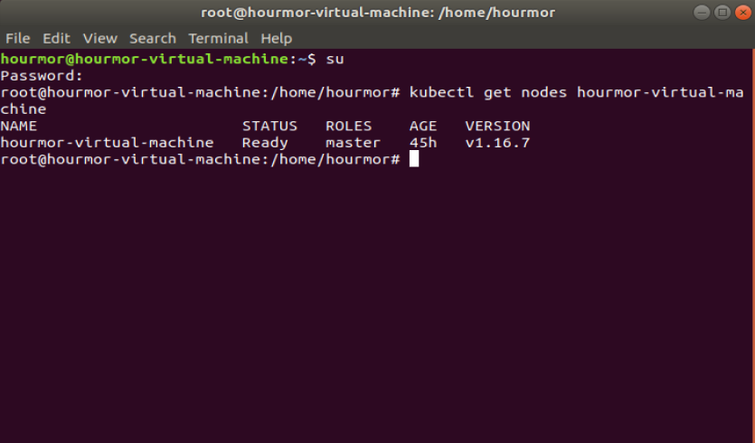
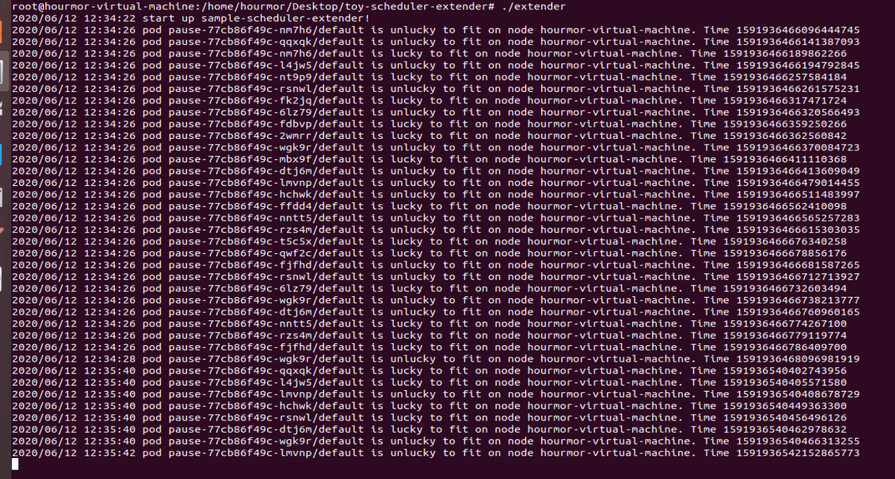
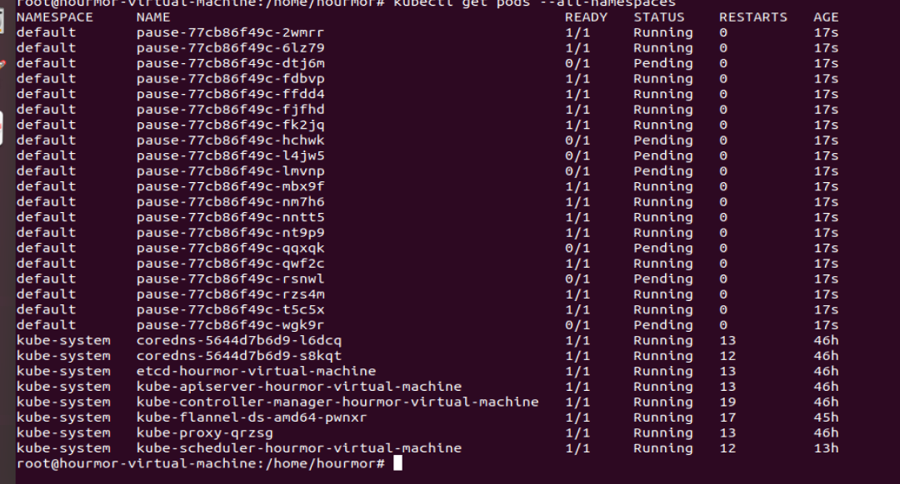

# toy-scheduler-extender
在**predicates.go**的**podFitsOnNode**函数内，简单对逻辑进行了修改，pod是否能被接受的依据是当前的时间是否是一个%2为0的数字，如果是的话我们就认为这是⼀个“被批准”的节点，否则拒绝批准该节点。


**predicates.go**

```
package controller

import (
...
	"time"
...
)
...
func LuckyPredicate(pod *v1.Pod, node v1.Node) (bool, []string, error) {
	time_get := time.Now().UTC().UnixNano() 
	lucky := (time_get % 2) == 0
	if lucky {
		log.Printf("pod %v/%v is lucky to fit on node %v. Time %v\n", pod.Name, pod.Namespace, node.Name,time_get)
		return true, nil, nil
	}
	log.Printf("pod %v/%v is unlucky to fit on node %v. Time %v\n", pod.Name, 
  ...
}

```


## Notes

- Because `k8s.io/kubernetes` pkg is not intended to be used with go get,so we need use go modules replace to depend these modules, so you must replace `go.mod` to your local k8s path .

- go version 1.14.4, **go.mod** was modified to fit

## 运行截图

环境配置成功



toy-scheduler-extender运行截图




